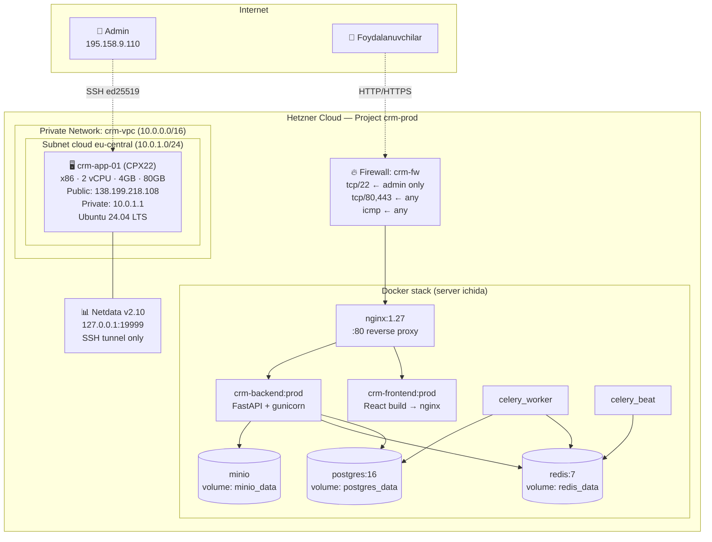

# CRM Production Deploy — Hetzner Cloud

Ulgurji Kiyim-kechak CRM'ni Hetzner Cloud serverga yetkazib berishning **to'liq
avtomatlashtirilgan** ko'rsatmasi. BTEC D.P8/M.P3 mezonlari uchun infra
qadamlari hujjatlangan: VPC, Firewall (Security Group), Cloud-init, Docker
provisioning, monitoring.

## Topologiya



## Tarmoq sxemasi (BTEC: VPC + Security Group)

| Komponent      | Hetzner ob'ekti           | ID/Manzil            | Maqsad |
|----------------|---------------------------|----------------------|--------|
| **VPC**        | Private Network `crm-vpc` | `10.0.0.0/16`        | Servislararo izolatsiya (kelajakda LB ↔ app server) |
| **Subnet**     | cloud / eu-central        | `10.0.1.0/24`        | Server uchun ichki interfeys |
| **Firewall**   | `crm-fw` (4 qoida)        | tcp/22, 80, 443, icmp | Tashqi tarmoq xavfsizligi |
| **Server**     | `crm-app-01` (CPX22)      | `138.199.218.108`    | Application + DB + Cache (yagona host) |
| **SSH Key**    | `crm-deploy` (ed25519)    | `infra/secrets/`     | Avtomatik deploy uchun |

## Talab qilinadigan vositalar (admin mashina)

- **hcloud CLI** ≥1.65 — `winget install HetznerCloud.CLI` yoki [GitHub releases](https://github.com/hetznercloud/cli/releases)
- **OpenSSH** (Windows 10+ ichida bor)
- **Hetzner API token** — Console → Security → API Tokens → Generate (Read & Write)
- **Git Bash** yoki WSL — `bash` skriptlar uchun

## ① Tokenni sozlash

```powershell
# Tokenni xavfsiz qo'shing — chat'da yoki commit'da OSHKOR QILMANG
hcloud context create crm-prod
# Token: ▮  (yopishtiring, ko'rinmaydi)
hcloud context list   # tasdiq
```

## ② Infrastrukturani yaratish (5 daqiqa)

Bitta skript barchasini yaratadi (idempotent — qayta ishlatilsa o'tkazib yuboradi):

```bash
cd clothing-crm/
./infra/hetzner/01_create_all.sh
```

Yaratiladigan resurslar (har biri bepul yoki birinchi sotda hisoblanadi):

1. **SSH kalit** (lokal `infra/secrets/id_ed25519_crm` + Hetzner upload)
2. **Private Network** `crm-vpc` 10.0.0.0/16 + subnet 10.0.1.0/24
3. **Firewall** `crm-fw` (4 qoida: SSH/admin, HTTP/any, HTTPS/any, ICMP/any)
4. **Server** `crm-app-01` (CPX22, $9.49/oy, ~$0.015/soat, prorated)

**Cloud-init** (`infra/cloud-init/app.yaml`) server boot vaqtida bajariladi:
- Tizim yangilash + paketlar (curl, ufw, fail2ban, htop, git)
- Docker CE + compose plugin
- `deploy` user (uid 1000, docker + sudo guruh, SSH kalit avtorizatsiyasi)
- SSH hardening (`PermitRootLogin no`, `PasswordAuthentication no`, MaxAuthTries 3)
- UFW (defense-in-depth Hetzner firewall ustiga)
- fail2ban (sshd jail, 5 urinish, 1 soat ban)
- Sysctl tuning (somaxconn, ip_local_port_range, file-max)
- Reboot — SSH hardening qo'llanishi uchun

Tugagandan keyin chiqadigan: `Public IPv4: <NEW_IP>` — uni keyingi qadamga ishlating.

## ③ CRM application provisioning

```bash
./infra/hetzner/02_provision.sh 138.199.218.108
```

Skript bajaradigan ishlar:
1. SSH bilan ulanish (admin IP firewall'dan o'tadi)
2. Source kodni serverga yuborish (rsync yoki tar+scp; private repo uchun git auth shart emas)
3. **Random sirlar** generatsiya (`openssl rand`):
   - `SECRET_KEY` — JWT (64 hex)
   - `POSTGRES_PASSWORD` — DB
   - `INITIAL_ADMIN_PASSWORD` — admin@crm.local
   - `MINIO_ROOT_PASSWORD` — S3 admin
4. `.env.prod` ni `chmod 600` bilan serverga yuborish
5. `docker compose -f docker-compose.prod.yml --env-file .env.prod up -d --build`
   - 8 ta xizmat quriladi va ishga tushiriladi (postgres + redis + backend + celery_worker + celery_beat + frontend + nginx + minio)
   - Birinchi build: ~10-15 daq (backend image ~250MB, frontend build ~1.5 min)
6. Healthcheck'larni kutish (postgres, redis, backend, frontend, nginx)
7. `alembic upgrade head` (DB schemasi — barcha faza migratsiyalari)
8. `python -m app.scripts.seed_rbac` (24 perm, 7 rol, admin user)
9. Smoke test (`curl /healthz`, `/api/v1/auth/login`, `/`, `/docs`)

## ④ Monitoring

```bash
./infra/hetzner/03_install_monitoring.sh 138.199.218.108
```

**Netdata** v2.10.x o'rnatiladi:
- Default port 19999, lekin **Hetzner firewall'da bloklangan** (faqat 22/80/443 ochiq)
- Faqat SSH tunnel orqali kirish mumkin (xavfsiz, parol kerak emas)

```bash
ssh -L 19999:127.0.0.1:19999 -i infra/secrets/id_ed25519_crm deploy@138.199.218.108
# keyin brauzerda: http://localhost:19999
```

Ko'rsatkichlar: CPU, RAM, disk I/O, tarmoq, har bir Docker container, Docker daemon, nginx, postgres, redis.

## ⑤ Domen va HTTPS (negative.uz)

Production domen: **https://negative.uz** (+ `www.negative.uz` → apex redirect).

**Talab (bir martalik tayyorgarlik):**

1. **DNS A-record** — registrar/DNS panelida:
   - `negative.uz` → `138.199.218.108`
   - `www.negative.uz` → `138.199.218.108`
   - TTL: 300s (testlash uchun), keyin 3600s
   - Tekshiruv: `nslookup negative.uz` → server IP'i qaytishi kerak
2. **Hetzner firewall** — 443 allaqachon ochiq (`infra/hetzner/firewall-rules.json`)
3. **`.env.prod`** — `DOMAIN=negative.uz`, `CERTBOT_EMAIL=admin@negative.uz` qo'shilgan
4. **Stack'ni yangilash** (yangi nginx.conf + certbot xizmati keladi):
   ```bash
   ssh deploy@138.199.218.108
   cd /opt/crm
   docker compose -f docker-compose.prod.yml --env-file .env.prod up -d --no-build --remove-orphans
   ```
5. **Birinchi sertifikatni olish** (BIR MARTA, idempotent):
   ```bash
   ./scripts/init-letsencrypt.sh
   ```
   - Mavjud cert tekshiriladi → bo'lsa nginx ko'tariladi va exit
   - Bo'lmasa: nginx to'xtatiladi → certbot standalone 80 portni oladi → cert
     volumega yoziladi → nginx yangi cert bilan ko'tariladi
   - Staging rejimida sinash uchun: `CERTBOT_STAGING=1 ./scripts/init-letsencrypt.sh`
   - **Eslatma**: sudo kerak emas — barcha amallar Docker konteynerlari ichida ishlaydi

**Avtomatik renewal:**
- `crm-certbot` konteyneri har 12 soatda `certbot renew` ishga tushiradi
- `crm-nginx` har 6 soatda `nginx -s reload` qiladi — yangilangan cert kuchga kiradi
- Hech qanday cron yoki qo'shimcha sozlash kerak emas

**Xavfsizlik headers** (TLS server blokida yoqilgan):
- `Strict-Transport-Security: max-age=31536000; includeSubDomains; preload` (HSTS)
- CSP, X-Frame-Options, X-Content-Type-Options, Referrer-Policy, Permissions-Policy

**Qaytish (rollback):**
Agar cert olishda muammo bo'lsa, vaqtincha eski nginx config'iga qaytarish uchun
`git revert` qilib qaytadan deploy qiling. Cert volumelar (`crm_certbot_certs`,
`crm_certbot_webroot`) saqlanadi — keyingi marta init-letsencrypt darhol ishlaydi.

## ⑥ Yangilash va deploy

GitLab CI/CD pipeline (`.gitlab-ci.yml`) `main`/`master`'ga push'da:
1. lint + test
2. Docker image qurish va Container Registry'ga push
3. Manual approval → SSH deploy (rsync compose+nginx, pull, up -d, alembic)

Qo'lda yangilash:
```bash
ssh deploy@138.199.218.108
cd /opt/crm
git pull   # yoki rsync yangilangan source
docker compose -f docker-compose.prod.yml --env-file .env.prod up -d --build
docker compose exec -T backend alembic upgrade head
```

## ⑦ Backup

```bash
# Manual:
ssh deploy@138.199.218.108 /opt/crm/scripts/backup-db.sh

# Cron (har kuni soat 02:00 UTC):
ssh deploy@138.199.218.108 'sudo tee /etc/cron.d/crm-backup' <<EOF
0 2 * * * deploy cd /opt/crm && ./scripts/backup-db.sh >> /var/log/crm-backup.log 2>&1
EOF
```

## ⑧ Restore

```bash
scp backup.sql.gz deploy@138.199.218.108:/tmp/
ssh deploy@138.199.218.108 /opt/crm/scripts/restore-db.sh /tmp/backup.sql.gz
# "YES" tasdiqlang
```

## ⑨ Infra'ni o'chirish (xarajatni to'xtatish)

```bash
hcloud server delete crm-app-01      # to'lov to'xtaydi
hcloud firewall delete crm-fw
hcloud network delete crm-vpc
hcloud ssh-key delete crm-deploy
```

## Xavfsizlik bo'yicha eslatmalar

| Element             | Status                              | Eslatma |
|---------------------|-------------------------------------|---------|
| SSH parol kirish    | ❌ O'chirilgan (`PasswordAuthentication no`) | Faqat ed25519 kalit |
| Root SSH            | ❌ Taqiqlangan (`PermitRootLogin no`) | `deploy` user + sudo |
| Firewall (Hetzner)  | ✅ Yopiq (faqat 22/admin, 80/443/any, icmp) | |
| UFW (OS-level)      | ✅ Defense in depth (deny incoming)  | 22, 80, 443 ochiq |
| fail2ban            | ✅ sshd jail (5 urinish → 1 soat ban) | |
| .env.prod           | ✅ chmod 600, faqat `deploy` user    | Repo'ga commit qilinmaydi |
| Sirlar              | ✅ `openssl rand` random generatsiya | Hech qachon repo'da yo'q |
| HCLOUD_TOKEN        | ⚠️ `~/.config/hcloud/cli.toml` ichida | Sessiyadan keyin almashtirish tavsiya |
| Netdata (19999)     | ✅ Hetzner FW'da yopiq               | SSH tunnel orqali ko'rish |
| MinIO (9000/9001)   | ⚠️ Hozir public (test uchun)        | Prod'da nginx orqali + auth qo'shish |

## Maslahatlar (BTEC dalil uchun)

- `screenshots/cloud__faza17__*.png` — har bosqichdan dalil
- `hcloud server list`, `hcloud firewall describe crm-fw`, `hcloud network describe crm-vpc` — natijalarni log qiling
- DNS/HTTPS qo'shilganda alohida faza screenshot'lari kerak
- Backup va restore demosini yozib oling (BTEC M.P3 mezoni — disaster recovery)
