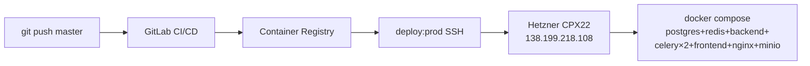

# Ulgurji Kiyim-kechak CRM

Ulgurji kiyim-kechak kompaniyasi uchun to'liq CRM tizimi.
**BTEC HND in Computing — Networking and Infrastructure** topshirig'i doirasida,
19 ta faza ichida bosqichma-bosqich yetkazib berilgan.

🌐 **Live demo**: http://138.199.218.108  (`/docs` — API Swagger)

[](https://gitlab.com/Elyorbek00/ulgurji-kiyim-kechak-kompaniyasi-crm/-/pipelines)
[](#sifat-ko'rsatkichlari)
[](#sifat-ko'rsatkichlari)

## Stek

| Qatlam | Texnologiyalar |
|--------|----------------|
| **Backend** | FastAPI 0.136 · PostgreSQL 16 · Redis 7 · SQLAlchemy 2 (async) · Alembic · Celery |
| **Frontend** | React 18 · TypeScript · Vite · TailwindCSS · shadcn/ui · TanStack Query · Zustand · i18next |
| **Auth** | JWT (HS256, access + refresh rotation) · bcrypt · brute-force lockout |
| **Infra** | Docker · docker-compose · nginx (reverse proxy) · MinIO (S3) |
| **CI/CD** | GitLab CI/CD (lint → test → build → deploy) · Container Registry |
| **Cloud** | Hetzner Cloud (CPX22) · Private Network · Firewall · cloud-init |
| **Monitoring** | Sentry (backend + frontend) · Netdata · structured logging |
| **Quality** | pytest 80%+ coverage · ruff · black · mypy · ESLint · Prettier · pre-commit |

## Tarkib

- [Tezkor boshlash](#tezkor-boshlash)
- [Lokal ishga tushirish](#lokal-ishga-tushirish-dockersiz)
- [Ma'lumotlar bazasi va migratsiyalar](#malumotlar-bazasi-va-migratsiyalar)
- [Xavfsizlik](#xavfsizlik)
- [CI/CD pipeline](#cicd-pipeline-gitlab--btec-dp8)
- [Hetzner Cloud deploy](#hetzner-cloud-deploy-faza-17--btec-mp3)
- [Sifat ko'rsatkichlari](#sifat-korsatkichlari)
- [Fazalar tarixi](#fazalar-tarixi)
- [Hujjatlar](#hujjatlar)

## Tezkor boshlash

```bash
git clone https://gitlab.com/Elyorbek00/ulgurji-kiyim-kechak-kompaniyasi-crm.git
cd ulgurji-kiyim-kechak-kompaniyasi-crm
cp backend/.env.example  backend/.env
cp frontend/.env.example frontend/.env
docker compose up --build
```

Endpointlar:
- Backend health: http://localhost:8000/health
- Frontend:       http://localhost:5173
- API docs:       http://localhost:8000/docs

## Lokal ishga tushirish (Docker'siz)

```bash
# Backend
cd backend
python -m venv .venv && .venv\Scripts\activate   # Windows
pip install -e ".[dev]"
alembic upgrade head
uvicorn app.main:app --reload
pytest                                            # 216 ta test

# Frontend (yangi terminalda)
cd frontend
npm install
npm run dev
npm test
```

## Ma'lumotlar bazasi va migratsiyalar

PostgreSQL 16 + asyncpg drayveri + Alembic. Umumiy mixinlar
(`backend/app/db/base.py`):
- `UUIDPrimaryKeyMixin` — `id: UUID` (default `uuid4`)
- `TimestampMixin` — `created_at`, `updated_at` (TZ-aware, server-side `NOW()`)
- `SoftDeleteMixin` — `deleted_at`, `is_deleted`, `soft_delete()`, `restore()`

```bash
docker compose exec backend alembic revision --autogenerate -m "..."
docker compose exec backend alembic upgrade head
docker compose exec backend alembic history --verbose
```

## Xavfsizlik

### Autentifikatsiya va vakolat
- **JWT (HS256)**: 15 daq access + 7 kun refresh (rotation — har refreshda yangi jti)
- **RBAC**: 7 ta rol (admin, director, manager, sales, warehouse, accountant, courier)
  × 24 ta ruxsat
- **Bcrypt** parol hashing (cost 12)

### Brute-force himoyasi
- **5 ta noto'g'ri urinish → 15 daqiqa lockout** (Redis counter per email)
- 429 Too Many Requests + `Retry-After` header
- Muvaffaqiyatli login counter'ni reset qiladi

### Audit log
- Har bir `LOGIN`, `LOGOUT`, `login_failed` `activity_logs` jadvalga yoziladi
- CRUD amallari ham (CREATE/UPDATE/SOFT_DELETE/RESTORE) qaysi user, qaysi
  obyektni qaysi IP'dan o'zgartirgani
- API: `GET /api/v1/hr/audit-logs` (filter: actor, action, entity_type, entity_id)

### Maxfiy ma'lumot himoyasi
- **Log redaction** filter: `password`, `token`, `secret`, `cookie`, `authorization`
  va boshqalar `***REDACTED***` bilan almashtiriladi (`app/core/logging.py`)
- **`.env*` fayllar git'da yo'q** (`.gitignore`'da)
- **`.gitlab-ci.yml` Variables** — barcha sirlar Masked + Protected
- **Hetzner API token** — `~/.config/hcloud/cli.toml` (`chmod 600`)

### Nginx security headers
| Header | Qiymat | Maqsad |
|--------|--------|--------|
| `X-Frame-Options` | `DENY` | Clickjacking |
| `X-Content-Type-Options` | `nosniff` | MIME sniff hujumi |
| `X-XSS-Protection` | `1; mode=block` | Eski brauzerlar XSS filtri |
| `Referrer-Policy` | `strict-origin-when-cross-origin` | Tashqi maqomot |
| `Permissions-Policy` | `camera=(), microphone=(), geolocation=(), ...` | API'lar |
| `Content-Security-Policy` | `default-src 'self'; ...` | XSS, code injection |
| `HSTS` | (HTTPS'da yoqiladi) | Mitm |

### Rate limit (nginx)
- `/api/v1/auth/login\|refresh` — **5 req/min per IP** (zone `auth_zone`)
- `/api/*` — **60 req/sec per IP** (zone `api_zone`)
- `client_max_body_size 10m` (rasm yuklash uchun)

### Tarmoq darajasidagi xavfsizlik
- **Hetzner Firewall**: tcp/80, tcp/443 hammaga; tcp/22 hamma (kalit-only auth)
- **SSH**: `PermitRootLogin no`, `PasswordAuthentication no`, `MaxAuthTries 3`,
  ed25519 only, `fail2ban` (5 urinish → 1 soat ban)
- **UFW** (OS-level): defense in depth, 22/80/443 ochiq, qolgan barchasi deny
- **Private Network** `crm-vpc` 10.0.0.0/16 (kelajakda LB + bir nechta app server)

### SQL injection / XSS
- **SQL**: SQLAlchemy ORM (parametrik query'lar) — raw SQL ishlatilmagan
- **XSS**: React JSX avtomatik escape qiladi; FastAPI JSON qaytaradi
  (HTML template render qilinmaydi)
- **CORS**: aniq origin'lar oq ro'yxati (`BACKEND_CORS_ORIGINS` env)

## CI/CD pipeline (GitLab) — BTEC D.P8

```
git push  →  lint  →  test  →  build (main)  →  deploy:prod (manual)
              │        │            │                  │
              │        │            ├ backend image    ├ rsync compose+nginx
              │        │            │ → registry       ├ SSH: docker login
              │        │            ├ frontend image   │   + pull
              │        │            │ → registry       │   + up -d --no-build
              │        │            └ (faqat main)     │   + alembic upgrade
              ├ ruff   ├ pytest                        └ image prune
              ├ black  │   + postgres:16
              ├ mypy   │   + redis:7
              └ eslint └ vitest + vite build
```

CI/CD Variables (GitLab → Settings → CI/CD → Variables):
| Variable | Type | Tavsif |
|----------|------|--------|
| `SSH_PRIVATE_KEY` | **File**, Protected | Hetzner deploy@SERVER_IP PEM |
| `SERVER_IP` | Var, Protected | `138.199.218.108` |
| `DB_PASSWORD` | Var, Masked, Protected | CI test stage postgres |
| `JWT_SECRET` | Var, Masked, Protected | CI test stage SECRET_KEY |
| `CI_REGISTRY_*` | **Auto** (GitLab) | Container Registry |

## Hetzner Cloud deploy (Faza 17) — BTEC M.P3



To'liq qadam-baqadam → [DEPLOY.md](DEPLOY.md)

Tezkor (token + IP berilganda):
```bash
./infra/hetzner/01_create_all.sh         # SSH key + VPC + Firewall + Server
./infra/hetzner/02_provision.sh <IP>     # SSH + .env + compose up + alembic + seed
./infra/hetzner/03_install_monitoring.sh # Netdata
```

## Sifat ko'rsatkichlari

| Mezon | Qiymat | Manba |
|-------|--------|-------|
| Backend testlar | **216 passed** | pytest |
| Backend coverage | **80.7%** | pytest-cov |
| Frontend testlar | **11 passed** | vitest |
| Lint (Python) | ✅ ruff + black + mypy | CI lint stage |
| Lint (TS) | ✅ ESLint + Prettier | CI lint stage |
| Production smoke | ✅ `/healthz`=ok, `/`=200, `/docs`=200 | Live server |
| `/healthz` throughput | **6399 req/sec** (ab -c 10) | [BENCHMARKS.md](BENCHMARKS.md) |
| DB query (orders dashboard) | cost 13.29 → **0.01** | EXPLAIN ANALYZE |

## Fazalar tarixi

| Faza | Mavzu | BTEC mezon |
|------|-------|------------|
| 1 | Loyiha skeleti (FastAPI + React) | setup |
| 2 | DB qatlami (mixinlar + Alembic async) | db |
| 3 | Auth + RBAC (JWT, 7 rol, 15 perm) | auth |
| 4 | HR moduli (Department/Position/Employee + audit) | hr |
| 5 | Katalog (Category daraxti + Brand + Product + Variant) | catalog |
| 6 | Ombor (Warehouse/Stock + reserve/release atomik) | warehouse |
| 7 | Mijozlar (Customer + kredit limit) | customer |
| 8 | Sotuv (Order state machine, Payment, Invoice, Return) | sales |
| 9 | Ta'minot (Supplier + PurchaseOrder) | procurement |
| 10 | Moliya (Account + Payment + DebtRecord ledger) | finance |
| 11 | Notification + WebSocket + Redis Pub/Sub | notification |
| 12 | Frontend skeleti (React+TS+Vite+Tailwind+...) | frontend |
| 13 | Mahsulotlar UI (list+filter+CRUD+variants) | products_ui |
| 14 | Quality (coverage 80%, lint+mypy+pre-commit) | quality |
| 15 | Production infra (Dockerfile+nginx+compose+Sentry+backup) | prod_infra |
| 16 | GitLab CI/CD pipeline (lint→test→build→deploy) | **D.P8** |
| 17 | Hetzner Cloud real deploy (hcloud + VPC + cloud-init) | **M.P3** |
| 18 | CI/CD avtomatik deploy demosi | **D.P8** |
| 19 | Xavfsizlik + audit + indekslar + docs + ROADMAP | **B.M2/D.M4** |

Har bir faza yakuni: **TEST → SCREENSHOT → COMMIT → "FAZA N TUGADI"**.
Tafsilot: [`screenshots/manifest.md`](screenshots/manifest.md) (60+ screenshot).

## Hujjatlar

| Fayl | Tavsif |
|------|--------|
| [README.md](README.md) | Bu fayl — umumiy ma'lumot |
| [DEPLOY.md](DEPLOY.md) | Hetzner Cloud production deploy qo'llanmasi |
| [BENCHMARKS.md](BENCHMARKS.md) | Optimizatsiya oldidan/keyin o'lchovlar (BTEC B.M2/D.M4) |
| [ROADMAP.md](ROADMAP.md) | Yo'l xaritasi — kelajak rejalar |
| [screenshots/manifest.md](screenshots/manifest.md) | BTEC dalillar manifesti |

## Litsenziya

Proprietary. © 2026 CRM dev (softweydev@gmail.com).
